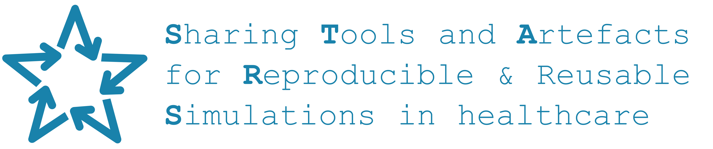

**Share your research openly with a simple website**

In this hands-on workshop, you'll learn how to build a straightforward Quarto website to share and organise your research. You will be introduced to using GitHub, Quarto and Markdown. No prior experience is needed - we'll guide you through each step using free, open tools that make it quick and straightforward to get a site online.

You'll see how a website can become a powerful hub for your work: a place to share notes, methods, outputs, and updates openly and accessibly. Your site could act as a:

* A homepage that brings together work across a theme, programme, or research area.
* A project site focused on a single study, collecting all results, any code, and outputs, and acting like an online appendix to a paper.

The workshop will give you **practical skills and templates you can adapt for your own research**. By the end, you'll have the foundations for your own site - and a clear sense of how open, well-documented work can make your research easier to share, reuse, and build on.

After the workshop, you can keep building on your site. Quarto has many possibilities, including adding blog posts, interactive figures, embedded code, galleries, teaching materials, or project updates. It's a flexible foundation that can grow with your research, learning, and collaborations - and is free and open to use and host your site.

## Contributors

## Funding

This course was developed as part of the [STARS project](https://pythonhealthdatascience.github.io/stars/). STARS is supported by the Medical Research Council [grant number MR/Z503915/1].

