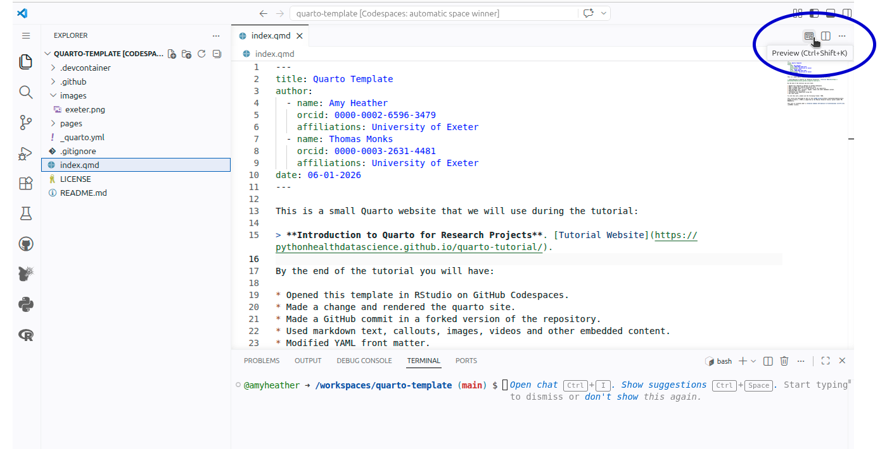
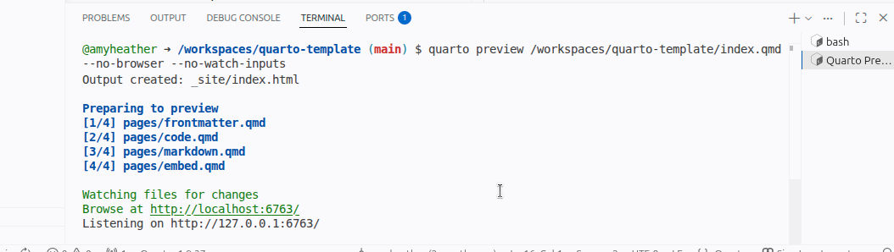
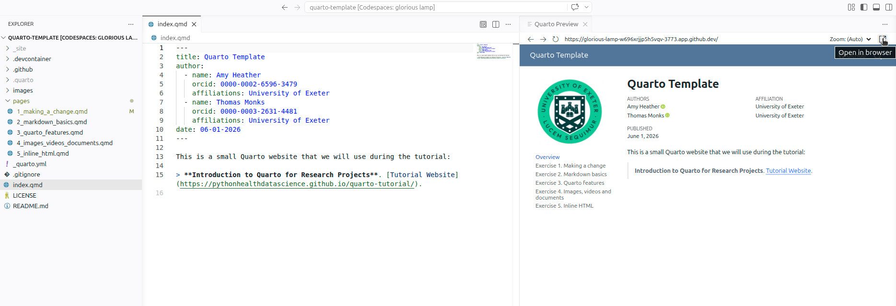
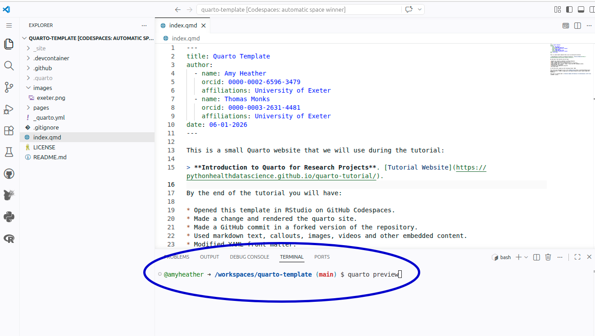

::: {.pale-blue}

**On this page we will:**

* Understand the two core files in a basic Quarto website.
* Learn how to render and preview the website.

:::

<br>

We'll be creating a **Quarto website**. A simple website project just needs two key files:

1. `_quarto.yml`
2. `index.qmd`

## `_quarto.yml`

This is file defines your **project settings** and **website structure**.

The file uses YAML, which is just a plain text format for settings, written as **key: value** pairs, for example `title: My website`. Indentation (spaces at the start of a line) shows that something belongs "inside" something else, a bit like folders within folders.

Below is an example from [quarto-template](https://github.com/pythonhealthdatascience/quarto-template){target="_blank"}. Hover over each line to see an explanation:

```yaml
project: # <1>
  type: website # <1>

website: # <1>
  title: "Quarto Template" # <2>
  favicon: images/exeter.png # <3>
  navbar: # <4>
    right: # <5>
      - icon: github # <5>
        text: GitHub # <5>
        href: https://github.com/pythonhealthdatascience/quarto-template/ # <5>
  sidebar: # <6>
    - logo: images/exeter.png # <7>
      contents: # <8>
        - text: Overview # <8>
          href: index.qmd # <8>
        - pages/TODO.qmd # <8>
```

1. **Website:** Defines that this project builds as a website.
2. **Website title:** Appears in broswer tab and navbar. 
3. **Favicon:** The small icon shown on the tab (often a logo).
4. **Navbar:** The navigation bar across the top of your site.
5. **GitHub link:** Adds a GitHub icon on the right side of the navbar linking to the repository (which contains the source files for the site).
6. **Sidebar:** Displays navigation links down the left-hand side.
7. **Logo:** The image shown at the top of the sidebar.
8. **Sidebar contents:** Lists website pages. Will list using page titles by default, but can override with `text` (title to use) and `href` (path to file).

::: {.callout-note title="Optional extra: books" collapse="true"}

A **Quarto book** is basically a website with chapter-style navigation. Under the hood, it's still a Quarto website - just organised a little differently.

See the [books guide](https://quarto.org/docs/books/book-output.html) for more information.

Example:

```yaml
project:
  type: book

book:
  title: "Quarto Template"
  favicon: images/exeter.png
  chapters:
    - text: Overview
      href: index.qmd
    - pages/TODO.qmd
  navbar:
    right:
      - icon: github
        text: GitHub
        href: https://github.com/pythonhealthdatascience/quarto-template/
  sidebar:
    logo: images/exeter.png
```

:::

## `index.qmd`

A `.qmd` file is a **Quarto Markdown** document. It mixes metadata at the top, text, and (optionally) code. For a website, `index.qmd` is treated as the **homepage:** when someone visits the root of your site, Quarto serves `index.html`, which comes from `index.qmd.

> If you're familiar with R Markdown (`.Rmd`), these are similar, but `.qmd` is more flexible.

Each `.qmd` file begins with **YAML front matter**, enclosed by three dashes (`---`). This defines metadata such as the page title. Below that is the page. Here we just have one sentence: `This is my homepage.`.

```{.r}
---
title: My homepage
---


This is my homepage.
```

## Rendering your website

**Rendering** means converting your Quarto source files into the final website - a collection of `.html` pages that live inside a folder called `_site`. To render your site:

1. Open `index.qmd` in the editor, and click the **Preview** button in the top right hand corner

{fig-alt="Screenshot of VSCode with Preview button circled."} 

2. In the bottom panel in the Terminal, you should see it says **Preparing to preview** and runs through files. It is creating `_sites/` folder containing your rendered site. Then when it is done, green text saying `Browse at ...`.

{fig-alt="Screenshot of the 'Preparing to preview' message in the Terminal."}

3. You are now viewing a **live preview** of your site in the browser. Nothing is public yet; this preview only runs on your own computer. In other words, you are the only person who can see this site right now, and it will not appear on the internet until you deliberately publish or upload the rendered files somewhere.

    By default, VSCode will open the preview in-line. This will be quite a small preview - to open it in a new tab, either copy the URL from the Terminal (`http://localhost:...`) or click the "Open in Browser" button in the top right.

{fig-alt="Screenshot of preview opened in-line, with cursor hovering over the 'Open in Browser' button."}

<br>


::: {.callout-note title="Optional extra: rendering via the terminal" collapse="true"}

Alternatively, you can render and preview your site directly via commands in the terminal.

In the bottom panel, ensure you are on the **Terminal** tab. The Terminal is a place where you type commands instead of clicking buttons. We just need to type `quarto preview` then press <kbd>Enter</kbd> on your keyboard.

{fig-alt="Screenshot of VSCode with 'quarto preview' command in Terminal circled."}

You can then use the `http://localhost:...` link printed in the Terminal to open your site in the browser.

With this method, the site updates automatically whenever files are saved. In Codespaces, files are auto‑saved very frequently, so the preview will re-render often; for that reason, the **Preview** button described above is usually a calmer option during this workshop.

:::
