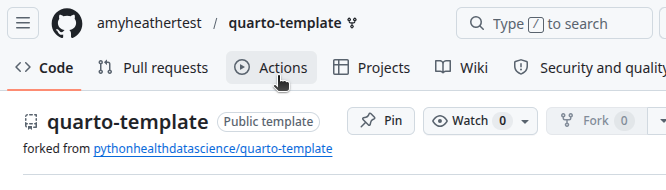
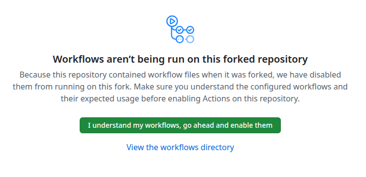
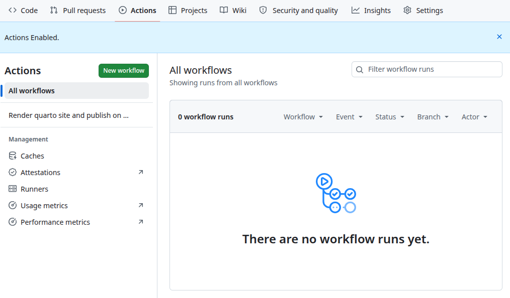
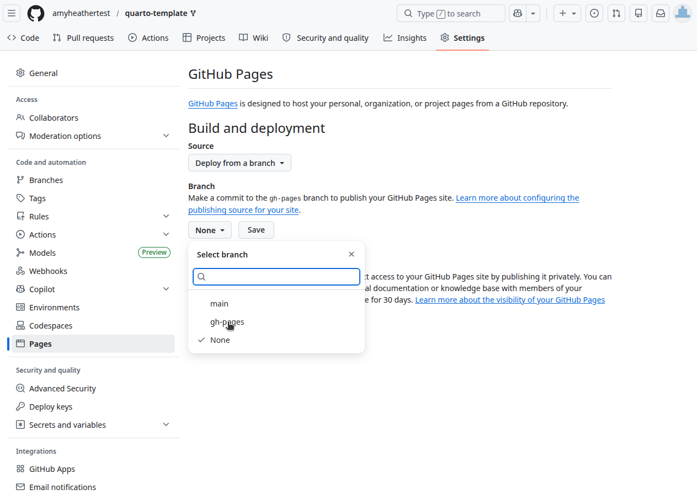
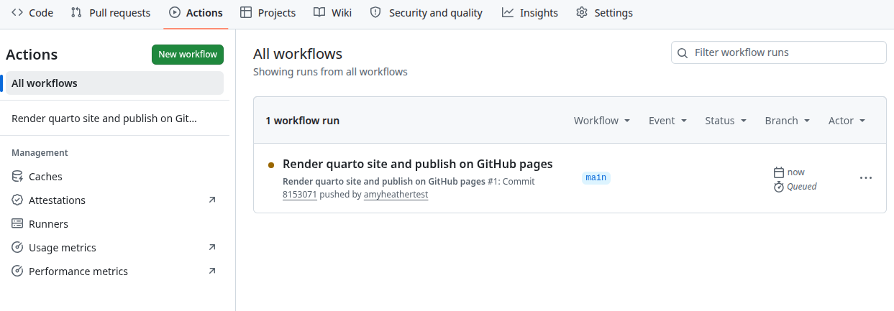
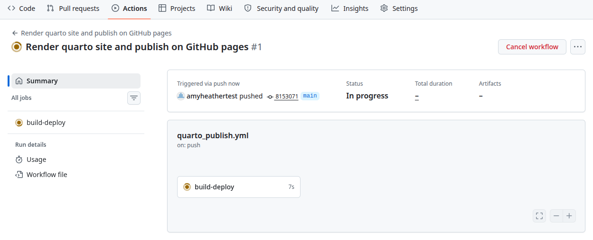
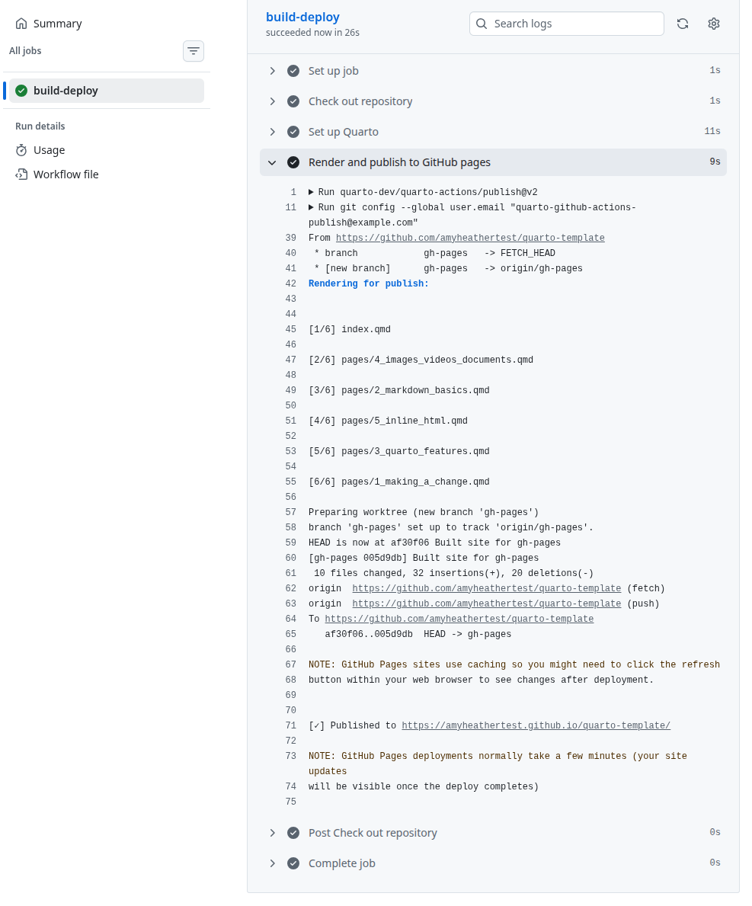
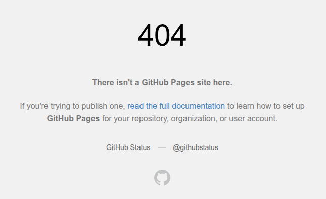
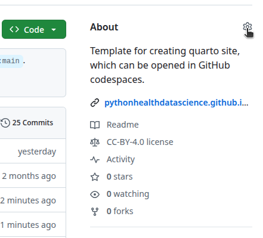
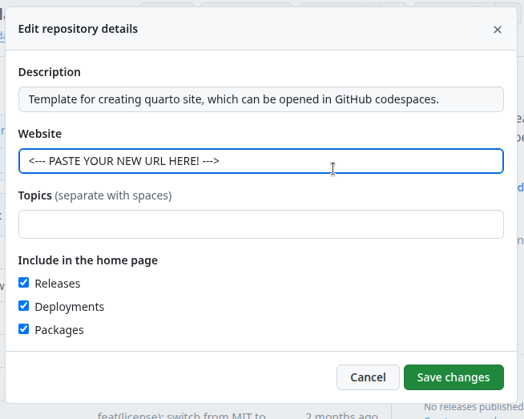

::: {.pale-blue}

**On this page we will:**

* Enable the GitHub action to automatically render and publish your site.
* Trigger a build and visit your live site.

:::

You can host your Quarto site for free using **GitHub Pages**. GitHub Pages takes the HTML files that Quarto creates and puts them on the web so that anyone with the link can see your site.

## Go to Actions tab

Open your fork of the `quarto-template` repository on GitHub. If you need to find it, go to GitHub → Repositories → `quarto-template`.

Click on the **Actions** tab.

{fig-alt="Screenshot of cursor hovering on Actions tab."}

## Enable workflows

GitHub will show a message that workflows aren't being run on this forked repository.

This is just a safety check. We know what the workflow does (it builds and publishes the Quarto site), so it is safe to enable it for this workshop.

Click the green button to enable Actions for this repository.

{fig-alt="Screenshot of 'Workflows aren't being run' message."}

After you click, you should see that Actions are now enabled:

{fig-alt="Screenshot of screen after clicking to enable actions."}

## Set the GitHub Pages branch

Next, tell GitHub Pages which branch to use for the website.

In your repository on GitHub, click on the **Settings** tab. In the left sidebar, click **Pages**.

Under **Branch**, change the source from `None` to `gh-pages`. Click **Save**.

> **Why `gh-pages`?**
>
> A Git repository can have more than one **branch**. You can think of branches as different versions or lines of development in the same project.  
> For this template, the main branch (`main`) holds your source files (the `.qmd` files, `_quarto.yml`, etc.), and the workflow puts the **built website** into a special branch called `gh-pages`.  
> GitHub Pages is then told, "Use the files from the `gh-pages` branch as the live website.""

{fig-alt="Screenshot of GitHub Pages settings page."}

## Make a commit to trigger the build

The workflow runs **each time you push a commit** to GitHub on the `main` branch. That is how your site will stay up to date.

Go back to your Codespace and make a small change to your site (e.g., edit some text on the homepage), then **commit and push** you change.

Then, return to your GitHub repository **Actions** tab, and you should see a new workflow run starting.

{fig-alt="Screenshot showing a workflow run in the Actions list."}

Then click on the `build-deploy` job to watch the steps. Near the end of the "Render and publish to GitHub pages" step, you should see a line with the URL of your site. Click that link (or copy and paste it into your browser).

{fig-alt="Screenshot of a running workflow with build-deploy job."}

Then click on the `build-deploy` job to watch the steps. Near the end, you should see a line with the URL of your site. Click that link (or copy and paste it into your browser).

{fig-alt="Screenshot showing the GitHub Pages URL in the workflow output."}

Sometimes, you may briefly see a 404 error while GitHub finishes publishing. If that happens, wait a few moments and refresh the page.



## Update the repository "About" url

To make the site easy to find later, add the GitHub Pages URL to the repository's "About" section.

On the main page of your repository on GitHub, look at the **About** box on the right, and click the small **settings** (gear) icon next to it.

{fig-alt="Screenshot of the About pane with the settings icon."}

Paste your GitHub Pages URL into the **Website** field then click **save changes**.

{fig-alt="Screenshot showing the Website field."}

<br>

---

## How did that work?

The publishing is handled by a **GitHub Actions workflow**. GitHub Actions is a service that can run steps for you in the cloud when certain events happen (for example, when you push a commit).

The instructions live in a workflow file in `.github/workflows/`. For this template, it looks like:


```{.yaml}
name: Render quarto site and publish on GitHub pages # <1>
run-name: Render quarto site and publish on GitHub pages # <1>

on: # <2>
  push: # <2>
    branches: main # <2>

jobs: # <3>
  build-deploy: # <3>
    runs-on: ubuntu-latest # <4>
    permissions: # <5>
      contents: write # <5>
    steps: # <6>
      - name: Check out repository # <7>
        uses: actions/checkout@v4 # <7>

      - name: Set up Quarto # <8>
        uses: quarto-dev/quarto-actions/setup@v2 # <8>

      - name: Render and publish to GitHub pages # <9>
        uses: quarto-dev/quarto-actions/publish@v2 # <9>
        with: # <9>
          target: gh-pages # <9>
        env: # <9>
          GITHUB_TOKEN: ${{ secrets.GITHUB_TOKEN }} # <9>
```

1. **name/run-name**: Labels for the workflow and its runs, so you can recognise them in the Actions tab.
2. **on: push: branches: main:** Tells GitHub to run this workflow whenever you push a commit to the `main` branch.  
3. **jobs / build-deploy:** Defines a job called `build-deploy` that does the work.  
4. **runs-on: ubuntu-latest:** Uses a fresh Linux (Ubuntu) virtual machine in the cloud to run the job.  
5. **permissions: contents: write:** Allows the job to write back to the repository (needed to update the `gh-pages` branch).
6. **steps:** The list of actions to perform.
7. **Check out repository:** Downloads the code from your repository into the runner.
8. **Set up Quarto:** Installs Quarto so it can render the site.
9. **Render and publish to GitHub Pages:** Renders the Quarto project and pushes the built site to the `gh-pages` branch using the `quarto-actions/publish` action. `GITHUB_TOKEN` is a special token that GitHub provides so the workflow can authenticate and push to your repository securely.
