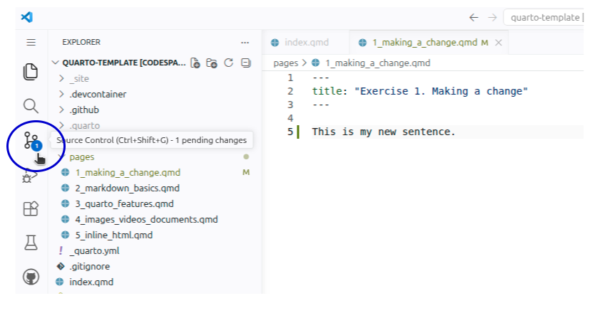
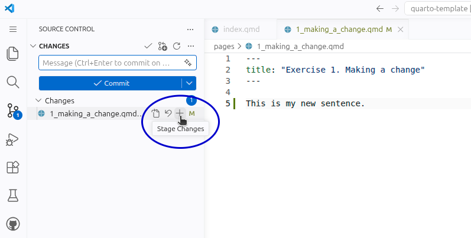
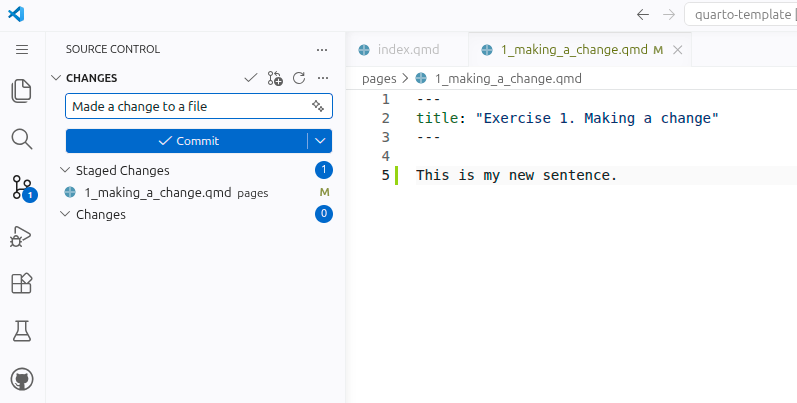
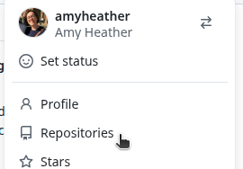

::: {.pale-blue}

**On this page we will:**

* Make a small change to your site.
* See how that change appears in the live preview.
* Save your work with a Git commit.
* Understand where the commit is pushed to.

:::

## Make a small change

1. Open the file `1_making_a_change.qmd`.

2. Add a short line of text in the body - for example `This is my new sentence.` You don't need to save - Codespace auto-saves any changes.

3. Click the <kbd>Preview</kbd> button - this will update your site with new changes, if you still have it open, or re-open it, with new changes.

4. Check: Does the page show your updated title and text?

## Save your change with Git

We are working in GitHub Codespaces, which uses **Git** for version control. Version control means Git keeps track of how your files change over time, so you can see what you changed, when you changed it, and go back if you make a mistake.

A commit is like a snapshot of your project at a particular moment. A commit records:

* Which files changed
* Exactly what changed
* Who made the change and a short message describing it

Now we will make a commit for the change you just made.

1. Click on the **Source Control** button in the sidebar.

{fig-alt="Screenshot of VSCode sidebar with Source Control button circled."}

2. In the Source Control panel, you should see your changed file listed. Hover over the file, and click the <kbd>+</kbd> button. This is called staging the file: you are telling Git "include this file in my next commit".

{fig-alt="Screenshot of cursor hovering over the '+' button"}

3. At the top of the Source Control panel, there is a box labelled Message. Type a short description of what you did, for example: `Made a change to a file`. Then click the blue <kbd>✓ Commit</kbd> button. This creates the commit: Git saves a snapshot of your project with your message attached.

{fig-alt="Screenshot showing a commit message has been written."}

4. After committing, you will see the button now says <kbd>Sync changes 1 ↑</kbd>. Click this to send your commit from Codespaces up to GitHub. This means your snapshot now lives safely in your GitHub repository as well as in the Codespace.

## Repositories and forks

To explain what just happened, we need two ideas: repository and fork.

* A **repository** (often shortened to "repo") is a project folder that Git is tracking. It contains your files and the history of commits.
* A **fork** is your own copy of someone else's GitHub repository. It lives under your GitHub account, so you are free to experiment without changing the original project.

In this tutorial you started from the `pythonhealthdatascience/quarto-template` repository, but you are working in **your fork** of that template. When you commit in Codespaces and sync, the commit is saved in the Codespace and then it is pushed to your fork on GitHub.

See your changes on GitHub...

1. In your browser, open GitHub (<https://github.com/>).

2. Go to your repoisitories by clicking your icon in the top right corner and then <kbd>Repositories</kbd> - for example:

{fig-alt="Screenshot of cursor hovering over the Repositories button."}

3. There, you should see `quarto-template` listed - this is your fork of the repository. Click on the title to open it.

4. Click the **Commits** link near the top to view the list of commits. Your latest commit (with the message you wrote) should appear at the top.
