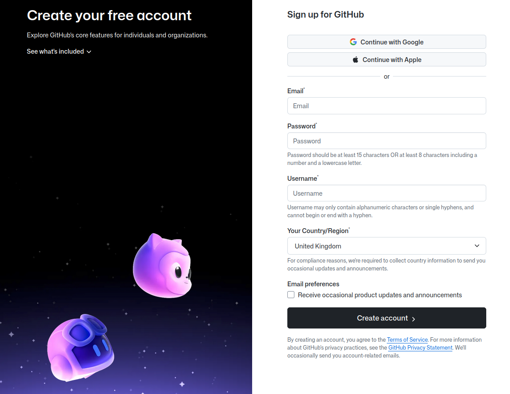
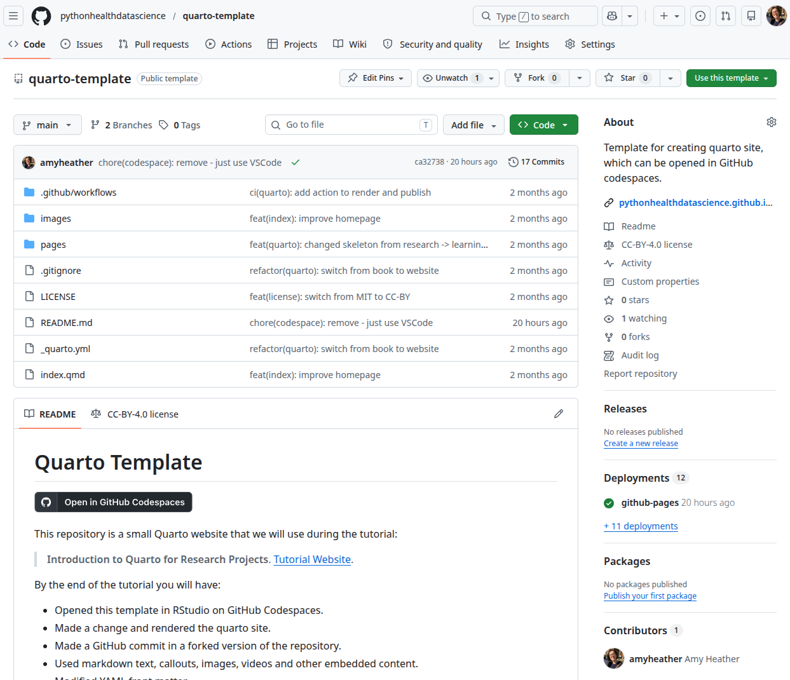
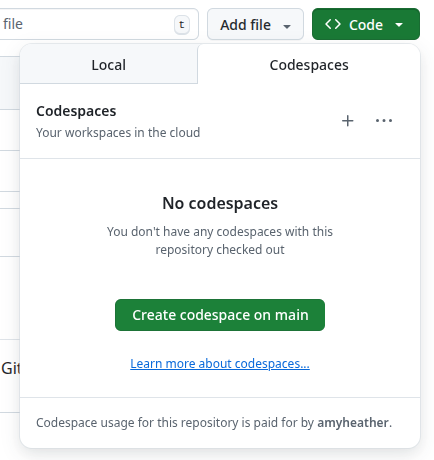
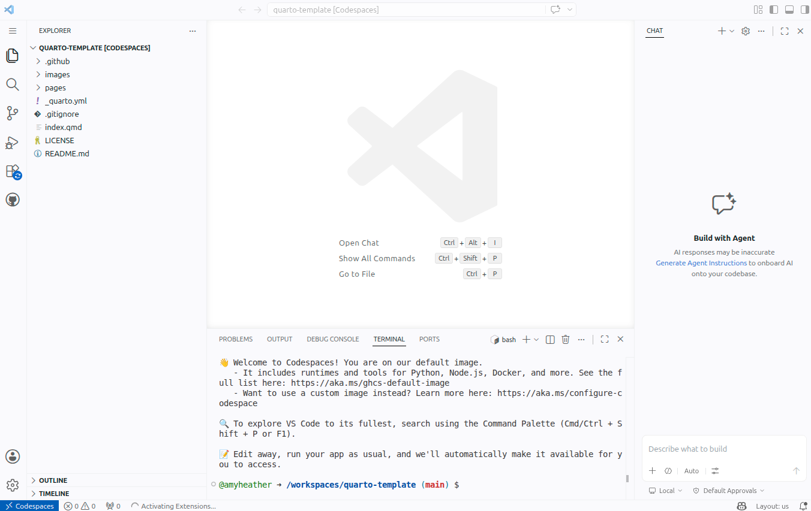
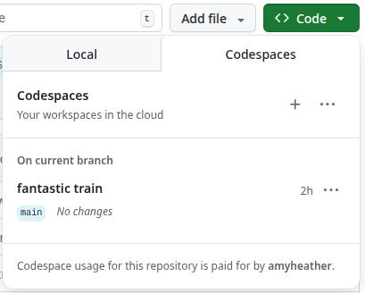

::: {.pale-blue}

**On this page we will:**

* Create a GitHub account.
* Open the Quarto website template in a web browser.
* Start a GitHub Codespace from the template.

:::

## Create a GitHub account

**GitHub** is a website where you can save files, track changes over time, and work together with other people on the same material. It is very popular for code, but you can also use it for documents, data, and teaching materials.

When your work is on GitHub, it is backed up in the cloud and you can access it from any computer with a web browser.

Sign up for an account here: <https://github.com/signup>

[{fig-alt="Screenshot from GitHub page to create a new account."}](https://github.com/signup)

## Go to our template repository

A **repository** (or **repo**) is just a folder on GitHub that holds all the files for one project, plus the full history of changes.

Our template repository is a ready-made project you can copy, so you start with all the right files and settings instead of building everything from scratch.

Go to our template repository here: <https://github.com/pythonhealthdatascience/quarto-template>

[{fig-alt="Screenshot of quarto-template GitHub repository"}](https://github.com/pythonhealthdatascience/quarto-template)

## Open GitHub codespaces

**GitHub Codespaces** gives you a ready-to-use workspace in your browser, so you do not need to install any software on your own computer. We will use it only to open and edit the text files that make up your Quarto website - you will not need to write any code.

To open a codespace from the template repository, click the green **Code** button, then choose the **Codespaces** tab, and click **Create codespace on main**.

{fig-align="center" fig-alt="Screenshot of repository showing Code > Codespaces > Create codespace on main"}

> You may see a message that Codespace usage for this repository is paid for by your account. For personal GitHub Free accounts, you get 120 hours of Codespaces time and 15 GB of storage each month at no cost. If you ever reach that free limit and have not added any card or payment method, GitHub will simply stop your Codespaces until the next month; you will not be charged.

GitHub will take a minute to prepare your Codespace, then open an editor in the browser with your project files on the left and a main editing area in the centre.

{fig-alt="Screenshot of the generated GitHub codespace."}

## Reopening your Codespace

If you close your Codespace and want to get back to it later (with all your changes still there), just return to the same GitHub repository.

Click the <kbd><> Code</kbd> button, open the <kbd>Codespaces</kbd> tab, and select your existing Codespace from the list.

{fig-align="center" fig-alt="Screenshot of existing Codespace list."}

Your codespace will automatically shut down after a period of inactivity (**30 minutes** by default) to save resources, but any edits you've saved will still be there when you reopen it.

By default, inactive codespaces are deleted after **30 days**.

For this workshop, we're using GitHub Codespaces because it's quick and easy to get started without installing anything. However, if you plan to work on similar projects regularly, we recommend **installing the required tools** (e.g., R and RStudio) on your own computer for more flexibility and long-term use.
