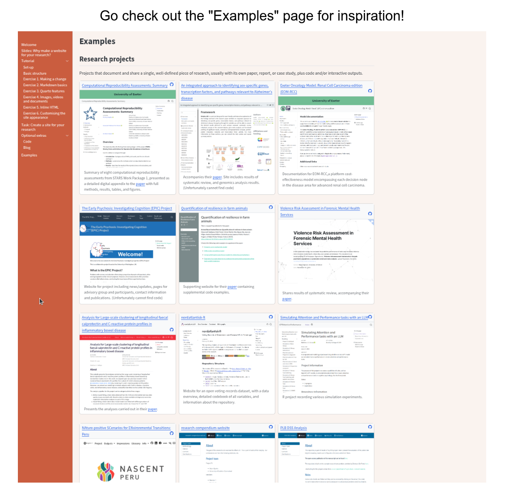

::: {.pale-blue}

**On this page we will:**

* Turn the template site into something related to your own work.
* Explore ideas for research project, group, or personal profile sites.
* Make at least one small change that you could build on later.

:::

You have been working with the `quarto-template` site. On this page, you will start turning that template into a site that is *about you* and your work.

You can choose any focus that feels useful right now:

- A **research project** (past, current, or planned)  
- A **research group or lab**  
- Your **personal research profile**  

If you are not sure what you want yet, have a look at the [Examples page](/pages/examples/index.qmd) in the site to see how other people use simple research websites.

You can also use one of the ideas below as a starting point.

[{fig-alt="Screenshot of examples page."}](/pages/examples/index.qmd)

## Research project site

Use the site to tell the story of a specific project. Possible sections:

- **Overview**: A short, plain-language summary of the project and why it matters.  
- **Aims and questions**: Bullet points for main research questions or objectives.  
- **Methods**: A brief description of data, methods, or models.
- **Team**: Names, roles, and links to collaborators.  
- **Outputs**: Links to papers, preprints, posters, talks, code, or datasets.

You might:

- Change the homepage text so it describes your project.  
- Add a "Project" page that lists aims, methods, and a simple timeline.  

## Research group or lab site

Use the site as a simple research group or lab homepage. Possible sections:

- **About the group**: Focus areas, themes, or mission.  
- **People**: Short profiles or a simple list of group members and roles.
- **Projects**: A few current or recent projects with one-line descriptions.  
- **Publications**: Selected outputs or a link to a full list elsewhere.  
- **Contact / joining**: How to get in touch or find out about opportunities.

You might:

- Rename existing pages to “People”, “Projects”, or “Publications”.  
- Add one short paragraph for each person or project.  

## Personal research profile

Use the site as your own academic website. Possible sections:

- **About / bio**: Who you are, your role, and main research interests. 
- **Publications or outputs**: Selected work you want people to find easily.  
- **Teaching / supervision**: Courses, workshops, or student projects.  
- **Talks / blog / notes**: Optional space for short posts or slides.  
- **Contact and links**: Email, ORCID, GitHub, institutional profile.

You might:

- Turn the homepage into a short “About me” with a photo.  
- Add a “Publications” or “Outputs” page with 5–10 key items.  
